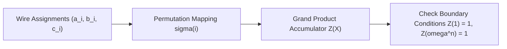

# Plonk Permutation Grand Product Skill

Robust, zero-dependency Python implementation of the **Plonk Copy-Constraint Permutation Argument**.

## Features
- **Grand Product Accumulator**: Proves wire routing consistency across non-adjacent circuit gates in \(O(n)\) field operations.
- **Schwartz-Zippel Lemma Security**: Random challenges \(eta, \gamma\) guarantee negligible soundness error.
- **Zero External Dependencies**: Pure Python standard library.
- **Native MCP Protocol**: JSON-RPC 2.0 stdio server compatible with Claude Desktop, Cursor, and Windsurf.

## Architecture

